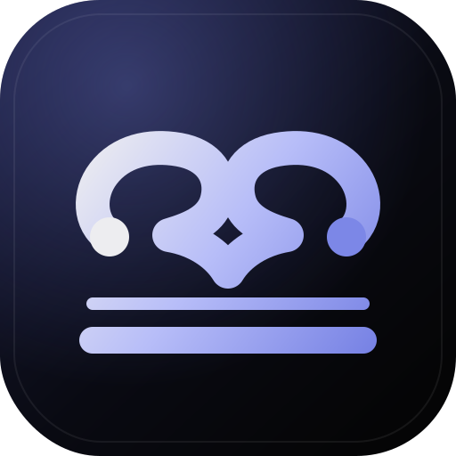
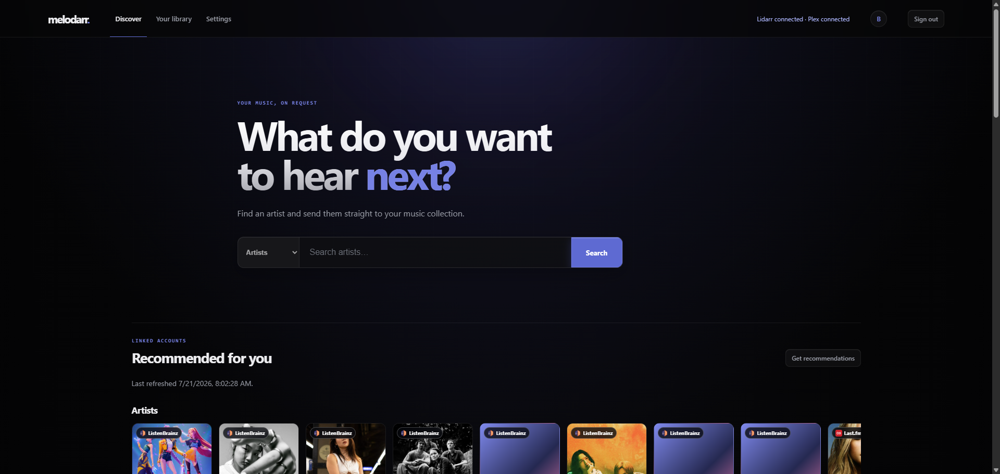
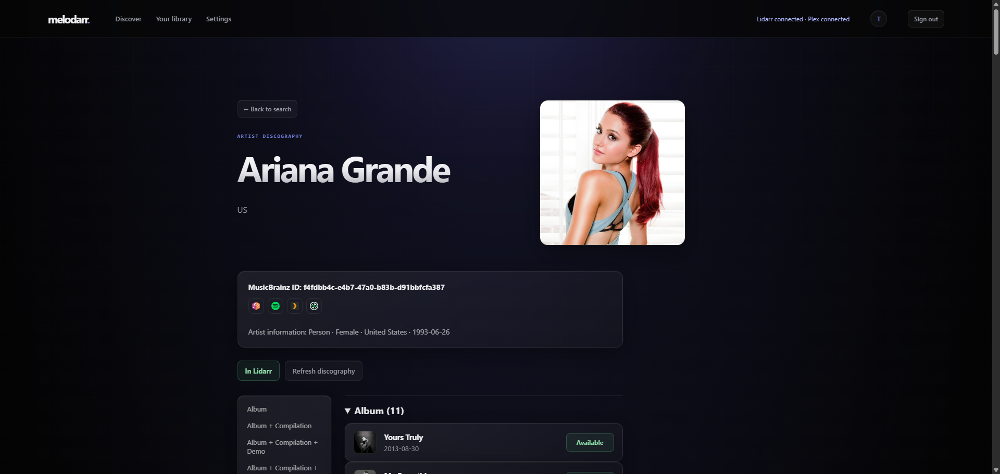
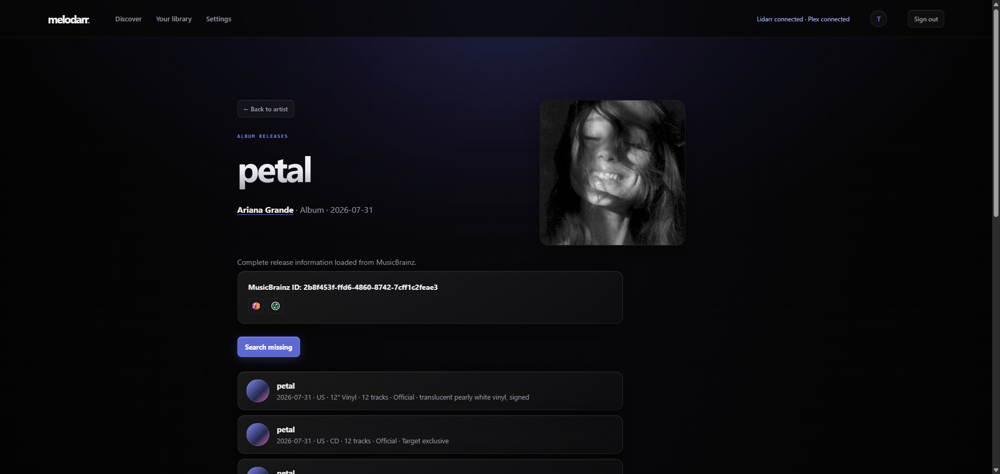
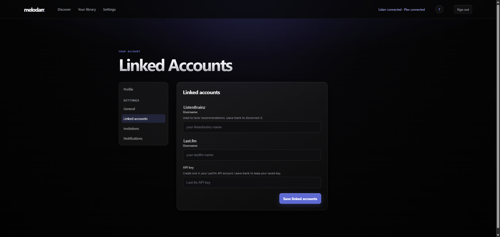

<p align="center">
  
</p>

# Melodarr

## 1. Overview

Melodarr is a self-hosted music discovery and request app for Lidarr. It gives household members a simple interface for finding artists and albums, exploring personalized recommendations, and sending requests to Lidarr, while optional Plex integration prevents suggestions for music that is already in your library.

Melodarr uses MusicBrainz for music metadata and can use ListenBrainz and Last.fm listening history for recommendations. It includes private accounts, administrator-managed invitations, persistent request history, background library scans, and local metadata and artwork caches.

## 2. Preview

### Discover music



### Explore an artist's discography



### Review releases and request missing music



### Link listening accounts



## 3. Features

- Search MusicBrainz for artists and albums, then browse discographies, releases, and tracklists.
- Request a complete artist or an individual release group through Lidarr.
- Apply Lidarr root folder, quality profile, metadata profile, monitoring, tag, and automatic-search defaults.
- Discover personalized artists and albums from linked ListenBrainz and Last.fm accounts.
- Filter recommendations and request controls using existing Lidarr entries, previous requests, and selected Plex music libraries.
- Browse the artists and album-level releases already available in Plex, with links back to Plex.
- Track queued Lidarr searches and album availability with automatic background jobs.
- Cache metadata and artwork locally to reduce upstream requests and improve response times.
- Create private user accounts through one-time, seven-day administrator invitations.
- Inspect job status, run maintenance jobs, and flush individual caches from the administrator dashboard.

## 4. Quick start

Melodarr is designed to run with Docker Compose. The included [`docker-compose.yml`](docker-compose.yml) uses the published `slimjimserver/melodarr:latest` image and persists application data in `./data`.

1. Download or copy the docker compose file from the repository.
2. Create the data directory before starting the container:

   ```bash
   mkdir -p data
   ```

   On Linux, the included Compose configuration runs Melodarr as UID/GID `1000:1000` by default. To use a different identity, set `PUID` and `PGID` in your shell or Compose `.env` file. The container prepares the data directory before dropping root privileges.

3. Start Melodarr:

   ```bash
   docker compose up -d
   ```

4. Open [http://localhost:5056](http://localhost:5056) and create the owner account. The first account is the administrator.
5. Open **Settings**, connect Lidarr, test the connection, and choose the defaults for new requests. Plex is optional.


## 5. Configuration

### Environment variables

No additional environment variables are required for the included Docker Compose setup. It already stores the main database and metadata cache beneath the persistent `/app/data` mount.

| Variable | Default | Purpose |
| --- | --- | --- |
| `PUID` | `1000` | Numeric user ID used to run Melodarr and own files beneath `/app/data`. Unraid commonly uses `99`. |
| `PGID` | `1000` | Numeric group ID used to run Melodarr and own files beneath `/app/data`. Unraid commonly uses `100`. |
| `MELODARR_DATABASE` | `<project>/melodarr.db` | Main SQLite database containing accounts, invitations, request history, and queued work. The image and Compose set this to `/app/data/melodarr.db`. |
| `MELODARR_CACHE_DATABASE` | `cache/metadata.db` beside the main database | Disposable external API-response cache. The image and Compose set this to `/app/data/cache/metadata.db`. |
| `MELODARR_SETTINGS` | `settings.json` beside the main database | Service configuration and credentials saved through the web UI. |
| `MELODARR_SECRET_KEY_FILE` | `session-secret.key` beside the main database | Persistent generated session-signing key file. |
| `MELODARR_SECRET_KEY` | Generated and saved to the key file | Explicit session-signing secret. Normally leave unset so Melodarr manages a persistent key in the data volume. |
| `MELODARR_ARTWORK_CACHE` | `<project>/data/cache/artwork` | Directory used for downloaded artist and album artwork. |
| `MELODARR_COOKIE_SECURE` | `false` | Set to `true` when Melodarr is served through HTTPS so session cookies are marked secure. |
| `PORT` | `5056` | Port used only by the local Flask development server. The production Gunicorn container listens on port `5056`. |
| `FLASK_DEBUG` | unset | Set to `1` only when running the local development server. Do not enable it in production. |

### Unraid Community Applications

Use `/app/data` as the container path for the persistent appdata mapping and configure:

```text
PUID=99
PGID=100
```

Do not also set Docker's `--user` option. The container starts as root only long enough to ensure `/app/data` exists with the requested ownership, then runs Melodarr as `PUID:PGID`. If the container is deliberately started with `--user`, Melodarr will honor that Docker-level identity but cannot change bind-mount ownership.

For an HTTPS deployment, add this to the service's `environment` block in `docker-compose.yml`:

```yaml
MELODARR_COOKIE_SECURE: "true"
```

### Service configuration

Service credentials are configured after signing in; they are not environment variables.

- **Lidarr (required for requests):** hostname or IP address, port, SSL choice, API key, and optionally an external browser-facing URL. After testing the connection, choose the root folder, quality and metadata profiles, monitoring behavior, tags, and automatic-search behavior.
- **Plex (optional):** server URL, authentication token, and one or more music libraries to scan.
- **ListenBrainz (optional, per user):** public ListenBrainz username.
- **Last.fm (optional, per user):** Last.fm username and API key.

Settings and service credentials are stored in `data/settings.json` when using Docker. Keep the data directory private. Back up `melodarr.db`, `settings.json`, and `session-secret.key`; the reproducible `cache/` directory can be excluded from backups.

Melodarr is licensed under the [GNU General Public License v3.0](LICENSE).
