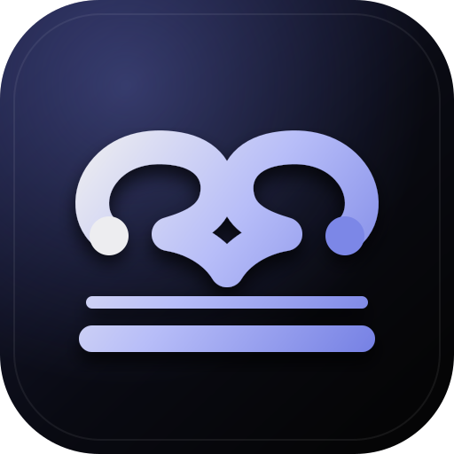
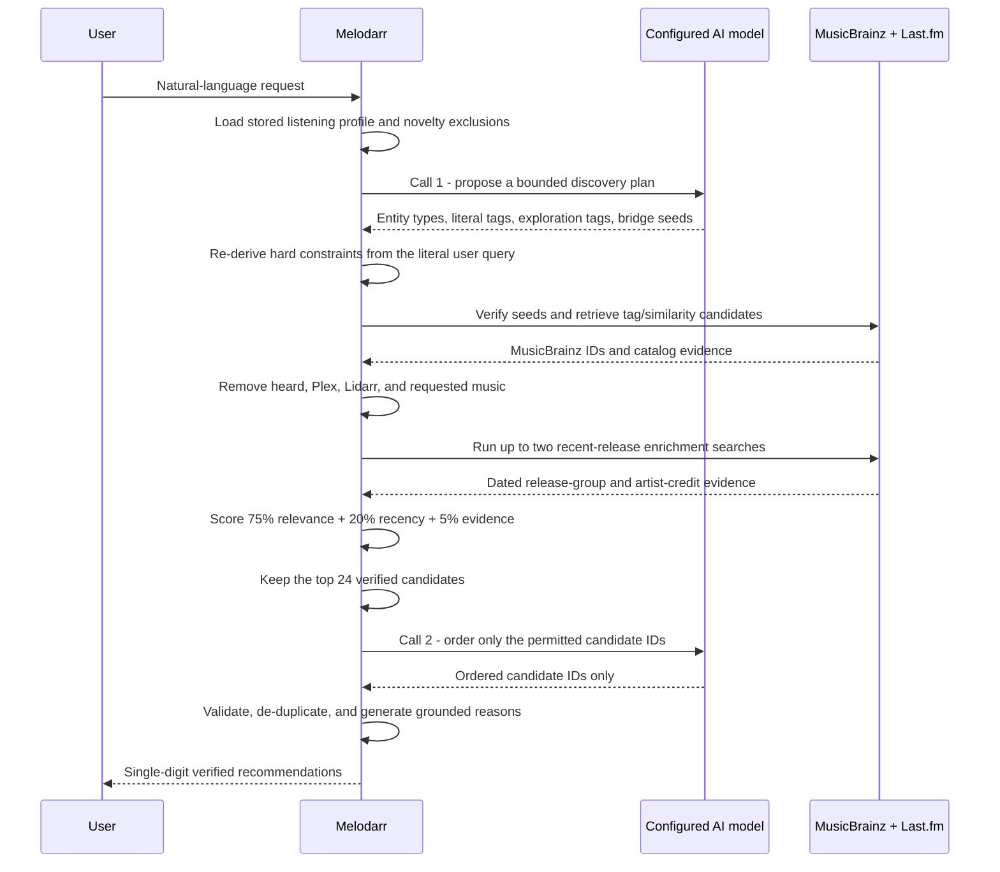

<p align="center">
  
</p>

# Melodarr

## 1. Overview

Melodarr is a self-hosted music discovery and request app for Lidarr. It gives household members a simple interface for finding artists and albums, exploring personalized recommendations, and sending requests to Lidarr, while optional Plex integration prevents suggestions for music that is already in your library.

Melodarr uses MusicBrainz for music metadata and can use ListenBrainz and Last.fm listening history for recommendations. It includes private accounts, administrator-managed invitations, persistent request history, background library scans, and local metadata and artwork caches.

## 2. Preview


### 📱 Screenshots

| Discover | Artist |
| :---: | :---: |
|  |  |
| **Release Group** | **Linked Accounts** |
|  |  |


## 3. Features

- Search MusicBrainz for artists and albums, then browse discographies, releases, and tracklists.
- Request a complete artist or an individual release group through Lidarr.
- Apply Lidarr root folder, quality profile, metadata profile, monitoring, tag, and automatic-search defaults.
- Discover personalized artists and albums from linked ListenBrainz and Last.fm accounts.
- Ask OpenAI, Claude, Gemini, LM Studio, or Ollama to rank verified new music for a user's private listening profile.
- Filter recommendations and request controls using existing Lidarr entries, previous requests, and selected Plex music libraries.
- Browse the artists and album-level releases already available in Plex, with links back to Plex.
- Track queued Lidarr searches and album availability with automatic background jobs.
- Cache metadata and artwork locally to reduce upstream requests, while revalidating viewed artist discographies in the background.
- Create private user accounts through one-time, seven-day administrator invitations.
- Inspect job status, run maintenance jobs, and flush individual caches from the administrator dashboard.

## 4. Quick start

Melodarr is designed to run with Docker Compose. The included [`docker-compose.yml`](docker-compose.yml) uses the published `slimjimserver/melodarr:latest` image and persists application data in `./data`.

1. Download or copy the docker compose file from the repository.
2. Create the data directory before starting the container:

   ```bash
   mkdir -p data
   ```

   On Linux, give Melodarr's fixed container user ownership of the directory:

   ```bash
   chown -R 1000:1000 data
   ```

   The image runs directly as UID/GID `1000:1000`. It does not start as root or change bind-mount ownership during startup.

3. Start Melodarr:

   ```bash
   docker compose up -d
   ```

4. Open [http://localhost:5056](http://localhost:5056) and create the owner account. The first account is the administrator.
5. Open **Settings**, connect Lidarr, test the connection, and choose the defaults for new requests. Plex and AI recommendations are optional.


## 5. Configuration

### Environment variables

No additional environment variables are required for the included Docker Compose setup. It already stores the main database and metadata cache beneath the persistent `/app/data` mount.

| Variable | Default | Purpose |
| --- | --- | --- |
| `MELODARR_DATABASE` | `<project>/melodarr.db` | Main SQLite database containing accounts, invitations, request history, and queued work. The image and Compose set this to `/app/data/melodarr.db`. |
| `MELODARR_CACHE_DATABASE` | `cache/metadata.db` beside the main database | Disposable external API-response cache. The image and Compose set this to `/app/data/cache/metadata.db`. |
| `MELODARR_SETTINGS` | `settings.json` beside the main database | Service configuration and credentials saved through the web UI. |
| `MELODARR_SECRET_KEY_FILE` | `session-secret.key` beside the main database | Persistent generated session-signing key file. |
| `MELODARR_SECRET_KEY` | Generated and saved to the key file | Explicit session-signing secret. Normally leave unset so Melodarr manages a persistent key in the data volume. |
| `MELODARR_ARTWORK_CACHE` | `<project>/data/cache/artwork` | Directory used for downloaded artist and album artwork. |
| `MELODARR_COOKIE_SECURE` | `false` | Set to `true` when Melodarr is served through HTTPS so session cookies are marked secure. |
| `MELODARR_AI_PROVIDER` | unset | Optional AI provider fallback: `openai`, `anthropic`, `gemini`, `lmstudio`, or `ollama`. Settings saved by an administrator take precedence. |
| `MELODARR_AI_MODEL` | provider default | Optional model override. LM Studio and Ollama require an exact model identifier available on their server. |
| `OPENAI_API_KEY` | unset | Optional server-side OpenAI credential. |
| `ANTHROPIC_API_KEY` | unset | Optional server-side Claude credential. |
| `GEMINI_API_KEY` / `GOOGLE_API_KEY` | unset | Optional server-side Gemini credential. `GEMINI_API_KEY` takes precedence. |
| `LM_STUDIO_BASE_URL` | `http://localhost:1234` | LM Studio origin reachable from the Melodarr process. `/v1` may be included or omitted. |
| `LM_STUDIO_API_KEY` | unset | Optional LM Studio API token when server authentication is enabled. |
| `OLLAMA_BASE_URL` | `http://localhost:11434` | Ollama origin reachable from the Melodarr process. |
| `PORT` | `5056` | Port used only by the local Flask development server. The production Gunicorn container listens on port `5056`. |
| `FLASK_DEBUG` | unset | Set to `1` only when running the local development server. Do not enable it in production. |

### Unraid Community Applications

Use this volume mapping:

```text
Host:      /mnt/user/appdata/melodarr
Container: /app/data
```

Do not map a host directory to `/app`; doing so hides Melodarr's application files. Only `/app/data` should be used for persistent storage.

To use Unraid's native `nobody:users` identity, prepare the directory once from the Unraid terminal:

```bash
mkdir -p /mnt/user/appdata/melodarr
chown -R 99:100 /mnt/user/appdata/melodarr
```

Then add this in the container's **Extra Parameters** field:

```text
--user 99:100
```

Remove any `PUID` or `PGID` variables from an older template; Melodarr no longer uses them. Docker's `--user` override starts Melodarr directly as `99:100`, without a root entrypoint.

For an HTTPS deployment, add this to the service's `environment` block in `docker-compose.yml`:

```yaml
MELODARR_COOKIE_SECURE: "true"
```

### AI recommendations

An administrator can enable AI recommendations from **Settings → AI recommendations**:

| Provider | Default model | Credential |
| --- | --- | --- |
| OpenAI | `gpt-5.6-sol` | OpenAI API key |
| Claude | `claude-sonnet-5` | Anthropic API key |
| Gemini | `gemini-3.6-flash` | Google AI API key |
| LM Studio | No universal default | Exact LM Studio model identifier, server URL, and optional API token |
| Ollama | No universal default | Exact installed model name and an Ollama server URL |

Each user should link ListenBrainz or Last.fm, or have usable Plex listening history, then allow the personalized recommendation refresh to complete. On **Discover**, choose **AI recommendations** from the Search type menu and enter a natural-language request such as “intricate late-night electronic music, but no artists I already know.” The four prompt templates beneath the shared search bar provide quick starting points.

Melodarr builds one private listening profile per user in the background every 24 hours and wakes that job after linked-account, shared Last.fm, Plex-history, and music-request changes. The durable profile combines Plex, Last.fm, ListenBrainz, and Melodarr requests into bounded short-, medium-, and long-term artist affinities; genre, style, and mood weights; recency, exploration, and diversity signals; familiar-artist/album exclusions; and per-source freshness and confidence. Familiar music is recorded only as a novelty exclusion, never inferred to be a dislike. If one provider is temporarily unavailable, Melodarr retains that provider's last good slice, marks it stale with reduced confidence, and retries after 15 minutes. An unexpected total build failure leaves the previously saved profile untouched.

AI calls read a deterministic compact projection of that stored profile rather than fetching listening services during the request. The projection uses tuple arrays and abbreviated documented keys and is capped at 6,000 characters, while retaining the canonical structured profile locally for future rebuilds. It contains display names, bounded counts/weights, freshness ages, recent request titles, and familiar-item counts; it excludes usernames, email addresses, linked-account IDs, credentials, service URLs, raw listening events, and event timestamps. A new account whose first daily build has not completed uses a request-only, no-network fallback and reports its profile as pending.

Melodarr uses the model as a creative discovery planner without treating it as a music database. The plan separates genres or styles literally present in the user's request (`mustMatchTags`) from adjacent genres, moods, and other model-proposed search directions (`discoveryTags`). Only the literal tags are hard filters, so “new drill rapper” must retain verified drill evidence while an open-ended prompt can explore several parts of the taste profile instead of collapsing to its first inferred genre. The model may also propose up to three bridge artists as discovery hypotheses. Those names are exact-match resolved to MusicBrainz before they can seed a Last.fm similarity lookup, and the seed itself is never a recommendation.

Melodarr searches those hypotheses through MusicBrainz and, when a shared Last.fm key is configured, Last.fm tag and similarity indexes. Every eligible artist or release must end with a UUID-shaped MusicBrainz identity, and familiar results found in the user's stored listening profile, Lidarr, Plex, or request history are removed. For artist searches, at most two additional MusicBrainz queries look for dated release groups and use their MusicBrainz artist credits as recent-activity evidence; an artist's founding date is never treated as music recency. Missing release dates receive a neutral recency score. Candidate order is deterministic: `75% catalog relevance + 20% release recency + 5% evidence depth`. Evidence depth starts at 30, adds 15 per matched tag, 20 per verified similarity bridge, and 10 per additional independent source, capped at 100. Releases from the last year score 100 for recency, then 90 within two years, 80 within three, 65 within five, 40 within ten, and 15 when older; an unknown date scores 50. Relevance therefore remains dominant, but newer music wins when two candidates fit equally well.

Only the highest-scoring 24 verified candidates can reach the optional second model pass. That pass remains a compact ordered-ID selection with at most 600 output tokens; it cannot introduce names, explanations, or IDs outside the server-created whitelist. Melodarr generates display reasons from trusted tag, similarity, and recent-release evidence. Targeted searches never fall back to unrelated Discover recommendations, and an empty verified result is shown instead of filler. The existing recommendation cache is used only for genuinely open-ended prompts that produce no search terms. Catalog searches and recent-release enrichment degrade independently when a source is unavailable. Recommendation quality still depends on the depth of the user's listening profile and external catalog tagging; no recommender can guarantee that every person will like every result.

The complete request flow is:


```mermaid
sequenceDiagram
    participant U as User
    participant M as Melodarr
    participant AI as Configured AI model
    participant C as MusicBrainz + Last.fm

    U->>M: Natural-language request
    M->>M: Load stored listening profile and novelty exclusions
    M->>AI: Call 1 - propose a bounded discovery plan
    AI-->>M: Entity types, literal tags, exploration tags, bridge seeds
    M->>M: Re-derive hard constraints from the literal user query
    M->>C: Verify seeds and retrieve tag/similarity candidates
    C-->>M: MusicBrainz IDs and catalog evidence
    M->>M: Remove heard, Plex, Lidarr, and requested music
    M->>C: Run up to two recent-release enrichment searches
    C-->>M: Dated release-group and artist-credit evidence
    M->>M: Score 75% relevance + 20% recency + 5% evidence
    M->>M: Keep the top 24 verified candidates
    M->>AI: Call 2 - order only the permitted candidate IDs
    AI-->>M: Ordered candidate IDs only
    M->>M: Validate, de-duplicate, and generate grounded reasons
    M-->>U: Single-digit verified recommendations
```

For a remote provider, Melodarr sends the user's prompt plus that compact daily taste projection and limited metadata for verified candidates. Query interpretation and candidate ranking are separate bounded structured calls when a live catalog search is required. It does not send the Melodarr username, email address, Plex identity, raw listening events, timestamps, credentials, or internal service URLs. With LM Studio or Ollama, the same payload goes only to the configured local server.

When Melodarr runs in Docker and the model server runs on the Docker host, use `http://host.docker.internal:1234` for LM Studio or `http://host.docker.internal:11434` for Ollama. The included Compose file maps that hostname on Linux. The model server must listen on an address reachable from the container; keep it restricted to the host or a trusted network. If both services share a Compose network, the model-server service name can be used instead. Melodarr uses LM Studio's OpenAI-compatible `/v1/chat/completions` endpoint and Ollama's native `/api/chat` endpoint.

Each local inference stage is allowed up to four minutes because prompt processing speed depends on the model and hardware. Query-aware requests can use one small planning stage followed by candidate ranking, so the production worker permits up to ten minutes for the complete request. The structured-output schema constrains the model to Melodarr's verified candidate IDs, and the server applies the same authoritative whitelist to the returned JSON. If Melodarr is behind a reverse proxy, configure its upstream response timeout for at least ten minutes so it does not disconnect first.

### Service configuration

Service credentials are normally configured after signing in. AI credentials can instead be supplied through the server-side environment variables listed above.

- **Lidarr (required for requests):** hostname or IP address, port, SSL choice, API key, and optionally an external browser-facing URL. After testing the connection, choose the root folder, quality and metadata profiles, monitoring behavior, tags, and automatic-search behavior.
- **Plex (optional):** sign in with the Plex account that owns the server, choose one of its advertised connections, and select one or more music libraries to scan. Plex tokens are retrieved through the secure Plex PIN flow and are never pasted into Melodarr.
- **ListenBrainz (optional, per user):** public ListenBrainz username.
- **Last.fm API access (optional, administrator-managed):** the owner or an administrator saves one Last.fm API key for the whole Melodarr instance. The key is never returned by the API or shown again after it is saved.
- **Last.fm listening history (optional, per user):** each user can add their own public Last.fm username to receive recommendations based on their listening history. Individual users do not need Last.fm API keys.
- **AI recommendations (optional, administrator-managed):** choose OpenAI, Claude, Gemini, LM Studio, or Ollama, then save the provider's server details, credential, and model as applicable. Stored API keys and LM Studio tokens are never returned by the API or shown again after they are saved.

Settings and service credentials are stored in `data/settings.json` when using Docker. Keep the data directory private. Back up `melodarr.db`, `settings.json`, and `session-secret.key`; the reproducible `cache/` directory can be excluded from backups.

Melodarr is licensed under the [GNU General Public License v3.0](LICENSE).
