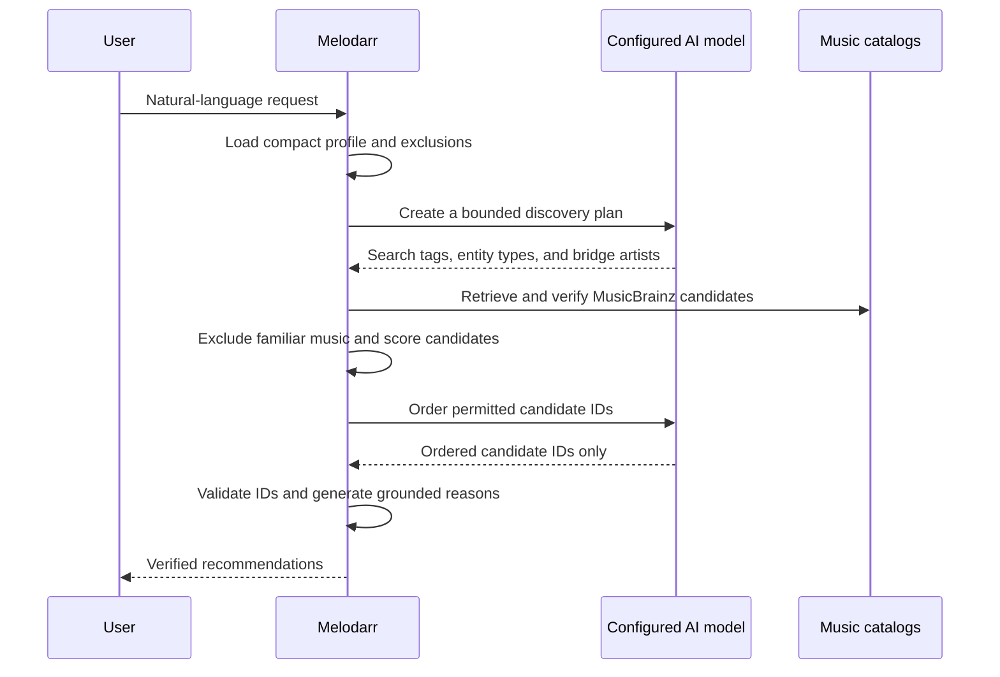

<p align="center">
  
</p>

# Melodarr

## 1. Overview

Melodarr is a self-hosted music discovery and request app for Lidarr. It gives household members a simple interface for finding artists and albums, exploring personalized recommendations, and sending requests to Lidarr, while optional Plex integration prevents suggestions for music that is already in your library.

Melodarr uses MusicBrainz for music metadata and can use ListenBrainz and Last.fm listening history for recommendations. It includes private accounts, administrator-managed invitations, persistent request history, background library scans, and local metadata and artwork caches.

## 2. Preview


### 📱 Screenshots

| Discover | Artist |
| :---: | :---: |
|  |  |
| **Release Group** | **Linked Accounts** |
|  |  |


## 3. Features

- Search MusicBrainz for artists and albums, then browse discographies, releases, and tracklists.
- Search AnimeThemes for an anime's openings, endings, episode ranges, and related series, then request conservatively matched MusicBrainz releases through Lidarr. Administrators can confirm the recommended automatic recording match or supply a correction; the selected recording, artist, and release-group MBIDs are stored permanently in the local SQLite registry ahead of the disposable API cache.
- Request a complete artist or an individual release group through Lidarr.
- Apply Lidarr root folder, quality profile, metadata profile, monitoring, tag, and automatic-search defaults.
- Discover personalized artists and albums from linked ListenBrainz and Last.fm accounts.
- Ask OpenAI, Claude, Gemini, LM Studio, or Ollama to rank verified new music for a user's private listening profile.
- Filter recommendations and request controls using existing Lidarr entries, previous requests, and selected Plex music libraries.
- Browse the artists and album-level releases already available in Plex, with links back to Plex.
- Track queued Lidarr searches and album availability with automatic background jobs.
- Cache metadata and artwork locally to reduce upstream requests, while revalidating viewed artist discographies in the background.
- Create private user accounts through one-time, seven-day administrator invitations.
- Inspect job status, run maintenance jobs, and flush individual caches from the administrator dashboard.

## 4. Quick start

Melodarr is designed to run with Docker Compose. The included [`docker-compose.yml`](docker-compose.yml) uses the published `slimjimserver/melodarr:latest` image and persists application data in `./data`.

1. Download or copy the docker compose file from the repository.
2. Create the data directory before starting the container:

   ```bash
   mkdir -p data
   ```

   On Linux, give Melodarr's fixed container user ownership of the directory:

   ```bash
   chown -R 1000:1000 data
   ```

   The image runs directly as UID/GID `1000:1000`. It does not start as root or change bind-mount ownership during startup.

3. Start Melodarr:

   ```bash
   docker compose up -d
   ```

4. Open [http://localhost:5056](http://localhost:5056) and create the owner account. The first account is the administrator.
5. Open **Settings**, connect Lidarr, test the connection, and choose the defaults for new requests. Plex and AI recommendations are optional.


## 5. Configuration

### Environment variables

No additional environment variables are required for the included Docker Compose setup. It already stores the main database and metadata cache beneath the persistent `/app/data` mount.

| Variable | Default | Purpose |
| --- | --- | --- |
| `MELODARR_DATABASE` | `<project>/melodarr.db` | Main SQLite database containing accounts, invitations, request history, and queued work. The image and Compose set this to `/app/data/melodarr.db`. |
| `MELODARR_CACHE_DATABASE` | `cache/metadata.db` beside the main database | Disposable external API-response cache. The image and Compose set this to `/app/data/cache/metadata.db`. |
| `MELODARR_SETTINGS` | `settings.json` beside the main database | Service configuration and credentials saved through the web UI. |
| `MELODARR_SECRET_KEY_FILE` | `session-secret.key` beside the main database | Persistent generated session-signing key file. |
| `MELODARR_SECRET_KEY` | Generated and saved to the key file | Explicit session-signing secret. Normally leave unset so Melodarr manages a persistent key in the data volume. |
| `MELODARR_ARTWORK_CACHE` | `<project>/data/cache/artwork` | Directory used for downloaded artist and album artwork. |
| `MELODARR_COOKIE_SECURE` | `false` | Set to `true` when Melodarr is served through HTTPS so session cookies are marked secure. |
| `MELODARR_AI_PROVIDER` | unset | Optional AI provider fallback: `openai`, `anthropic`, `gemini`, `lmstudio`, or `ollama`. Settings saved by an administrator take precedence. |
| `MELODARR_AI_MODEL` | provider default | Optional model override. LM Studio and Ollama require an exact model identifier available on their server. |
| `OPENAI_API_KEY` | unset | Optional server-side OpenAI credential. |
| `ANTHROPIC_API_KEY` | unset | Optional server-side Claude credential. |
| `GEMINI_API_KEY` / `GOOGLE_API_KEY` | unset | Optional server-side Gemini credential. `GEMINI_API_KEY` takes precedence. |
| `LM_STUDIO_BASE_URL` | `http://localhost:1234` | LM Studio origin reachable from the Melodarr process. `/v1` may be included or omitted. |
| `LM_STUDIO_API_KEY` | unset | Optional LM Studio API token when server authentication is enabled. |
| `OLLAMA_BASE_URL` | `http://localhost:11434` | Ollama origin reachable from the Melodarr process. |
| `PORT` | `5056` | Port used only by the local Flask development server. The production Gunicorn container listens on port `5056`. |
| `FLASK_DEBUG` | unset | Set to `1` only when running the local development server. Do not enable it in production. |

### Unraid Community Applications

Use this volume mapping:

```text
Host:      /mnt/user/appdata/melodarr
Container: /app/data
```

Do not map a host directory to `/app`; doing so hides Melodarr's application files. Only `/app/data` should be used for persistent storage.

To use Unraid's native `nobody:users` identity, prepare the directory once from the Unraid terminal:

```bash
mkdir -p /mnt/user/appdata/melodarr
chown -R 99:100 /mnt/user/appdata/melodarr
```

Then add this in the container's **Extra Parameters** field:

```text
--user 99:100
```

Remove any `PUID` or `PGID` variables from an older template; Melodarr no longer uses them. Docker's `--user` override starts Melodarr directly as `99:100`, without a root entrypoint.

For an HTTPS deployment, add this to the service's `environment` block in `docker-compose.yml`:

```yaml
MELODARR_COOKIE_SECURE: "true"
```

### AI recommendations

Administrators can enable AI recommendations from **Settings → AI recommendations**:

| Provider | Default model | Credential |
| --- | --- | --- |
| OpenAI | `gpt-5.6-sol` | OpenAI API key |
| Claude | `claude-sonnet-5` | Anthropic API key |
| Gemini | `gemini-3.6-flash` | Google AI API key |
| LM Studio | None | Model identifier, server URL, and optional API token |
| Ollama | None | Installed model name and server URL |

Users open **Discover**, select **AI recommendations** from the Search type menu, and describe what they want. Linking ListenBrainz, Last.fm, or Plex provides better personalization; Melodarr also learns from its request history.

Melodarr refreshes a compact private listening profile for each user every 24 hours and after relevant account or history changes. It summarizes artist affinities, genres, moods, listening patterns, recent requests, and familiar music; familiar items are excluded from discovery, not treated as dislikes. Temporary source failures retain the last successful profile with reduced confidence.

The model proposes search directions; Melodarr searches MusicBrainz and optional Last.fm indexes, verifies every result has a MusicBrainz ID, and removes music already heard, owned, or requested. Candidates are scored primarily for catalog relevance, with newer releases favored when fit is otherwise similar (`75% relevance + 20% recency + 5% evidence`). Only the top 24 verified candidates can reach the ranking pass, and the model can return only IDs from that whitelist. Targeted searches return no result rather than unrelated filler.


```mermaid
sequenceDiagram
    participant U as User
    participant M as Melodarr
    participant AI as Configured AI model
    participant C as Music catalogs

    U->>M: Natural-language request
    M->>M: Load compact profile and exclusions
    M->>AI: Create a bounded discovery plan
    AI-->>M: Search tags, entity types, and bridge artists
    M->>C: Retrieve and verify MusicBrainz candidates
    M->>M: Exclude familiar music and score candidates
    M->>AI: Order permitted candidate IDs
    AI-->>M: Ordered candidate IDs only
    M->>M: Validate IDs and generate grounded reasons
    M-->>U: Verified recommendations
```

Each request sends the prompt, minimized taste profile, and verified candidate metadata to the configured provider. Melodarr omits account identifiers, credentials, internal URLs, and raw listening events from the generated profile, but it does not redact prompt text. Providers or local model servers may retain request bodies; users should not enter personal information or secrets.

LM Studio and Ollama use administrator-configured endpoints. HTTP is unencrypted, so prefer HTTPS or a trusted isolated network and review the model server's logging settings. From Docker, use `host.docker.internal` for a model server on the host, or its service name on a shared Compose network.

Local inference allows up to four minutes per model stage and ten minutes for the complete request. Reverse proxies should use an upstream timeout of at least ten minutes.

### Service configuration

Service credentials are normally configured after signing in. AI credentials can instead be supplied through the server-side environment variables listed above.

- **Lidarr (required for requests):** hostname or IP address, port, SSL choice, API key, and optionally an external browser-facing URL. After testing the connection, choose the root folder, quality and metadata profiles, monitoring behavior, tags, and automatic-search behavior.
- **Plex (optional):** sign in with the Plex account that owns the server, choose one of its advertised connections, and select one or more music libraries to scan. Plex tokens are retrieved through the secure Plex PIN flow and are never pasted into Melodarr.
- **ListenBrainz (optional, per user):** public ListenBrainz username.
- **Last.fm API access (optional, administrator-managed):** the owner or an administrator saves one Last.fm API key for the whole Melodarr instance. The key is never returned by the API or shown again after it is saved.
- **Last.fm listening history (optional, per user):** each user can add their own public Last.fm username to receive recommendations based on their listening history. Individual users do not need Last.fm API keys.
- **AI recommendations (optional, administrator-managed):** choose OpenAI, Claude, Gemini, LM Studio, or Ollama, then save the provider's server details, credential, and model as applicable. Stored API keys and LM Studio tokens are never returned by the API or shown again after they are saved.

Settings and service credentials are stored in `data/settings.json` when using Docker. Keep the data directory private. For a consistent backup, stop Melodarr cleanly before copying `melodarr.db`, `settings.json`, and `session-secret.key`. If the service must remain online, back up `melodarr.db` with SQLite's online backup API or the SQLite shell's `.backup` command; do not make a raw copy of a live database because committed data may still be in its WAL file. The reproducible `cache/` directory can be excluded from backups.

Melodarr is licensed under the [GNU General Public License v3.0](LICENSE).
